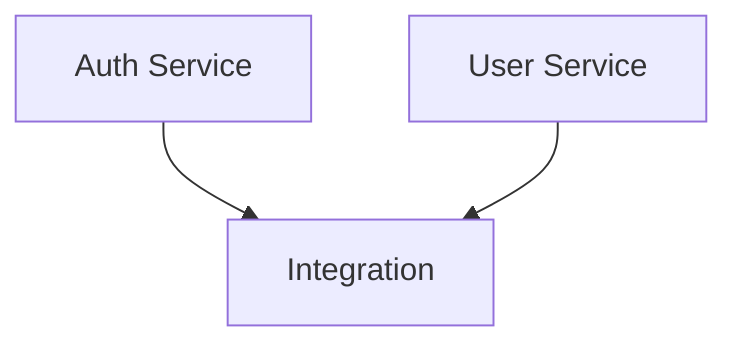

# Parallel Phase Breakdown Support

## Problem/Goal
The current task-breakdown skill creates subtasks that share a single branch and execute sequentially. For larger projects, a more sophisticated parallelism model is needed where:
- Tasks are organized into **phases** (parallel → sequential → parallel)
- Independent tasks within a phase can be dispatched to separate agents
- Dependencies between phases are explicitly tracked
- Integration with `para dispatch` enables true parallel agent execution

This extends the task-breakdown skill to support the phased breakdown model from `docs/breakdown.md` and github/speckit principles.

## Success Criteria

### Spec-First Artifacts
- [ ] Breakdown generates `data-model.md` with shared entity schemas/types
- [ ] Breakdown generates `contracts/` directory with API interface definitions
- [ ] Breakdown generates `quickstart.md` with runtime testing guidance

### Parallel Task Identification
- [ ] Parallel-safe subtasks marked with `[P]` after numeric prefix (e.g., `01-[P]auth-service.md`)
- [ ] Sequential/blocking tasks unmarked (e.g., `02-shared-types.md`)
- [ ] Dependency graph shows which tasks block others

### Dependency Visualization
- [ ] Generate dependency matrix (text table showing task → depends_on relationships)
- [ ] Generate MermaidJS diagram for visual dependency graph
- [ ] Either embedded in task-breakdown or complementary skill

### Decomposition Engine (Deterministic)
- [ ] Script estimates t-shirt size from criteria count, file scope, integration points
- [ ] Script applies decomposition principles (API-first, domain-first, infrastructure-first)
- [ ] Script identifies contract boundaries for parallelization

### SKILL.md Guidance
- [ ] When-to-use heuristics for each decomposition principle
- [ ] Examples of data-model and contract generation
- [ ] Decision matrix: t-shirt size → breakdown granularity

### Integration
- [ ] Extends existing task-breakdown skill (not replace)
- [ ] Output compatible with worktree-orchestrator

## Context Manifest

### How the Current Task-Breakdown Skill Works

The existing task-breakdown skill at `plugins/task-breakdown/` provides systematic task decomposition into cc-sessions directory structures. It operates through three Bun/TypeScript scripts that analyze tasks, generate subtask files, and update indexes.

**analyze_task.ts** parses task frontmatter and extracts success criteria using the regex `/## Success Criteria[\s\S]*?(?=\n## [^#]|$)/i` which captures nested subsections. It determines complexity: Low (1-3 criteria), Medium (4-6), High (7+). These thresholds trigger breakdown suggestions in SKILL.md.

**generate_subtasks.ts** converts file tasks to directories, creates subtask files with proper frontmatter inheritance (subtasks have `parent` field but NO `branch` field - they inherit from parent), and updates the parent README.md with a `## Subtasks` section. The multi-task → single-branch pattern enables all subtasks to share one worktree.

**update_indexes.ts** updates task index files from `` `task.md` `` to `` `task/` `` notation when tasks become directories.

All scripts support `--json` output for programmatic use and `--dry-run` mode for safe previewing.

### What Parallel Phase Breakdown Adds

The new model from `docs/breakdown.md` organizes subtasks into **phases** with explicit parallelism markers, enabling true concurrent execution via `para dispatch`.

**Phased Directory Structure:**
```
h-implement-system/
├── README.md
├── BREAKDOWN_OVERVIEW.md
├── specs/
│   ├── data-model.md
│   ├── contracts/
│   └── quickstart.md
├── phase_1_parallel/
│   ├── P1_1_auth-service.md
│   └── P1_2_user-service.md
└── phase_2_sequential/
    └── P2_1_integration.md
```

**The `[P]` Marker System:** Parallel-safe tasks are marked `01-[P]auth-service.md` signaling they can run concurrently with other `[P]` tasks in the same phase. Sequential tasks lack this marker and create phase barriers.

**Spec-First Artifacts** (from Specification-Driven Development in `docs/spec-driven.md`):

1. **data-model.md**: Shared entity schemas preventing parallel tasks from implementing incompatible data structures
2. **contracts/ directory**: API interface definitions and protocol specs defining integration boundaries
3. **quickstart.md**: Runtime testing guidance and validation scenarios

**Decomposition Principles** determine phase structure:
- **API-First**: Define contracts first, then parallelize implementation
- **Domain-First**: Start with data-model.md, then build services
- **Infrastructure-First**: Set up CI/CD before implementation
- **Test-First**: Define tests early for other tasks to reference

**T-shirt Sizing Algorithm:**
- **XS** (1-2 criteria, 1 file): No breakdown
- **S** (3-4 criteria, 2-3 files): Simple breakdown (2-3 subtasks)
- **M** (5-7 criteria, 4-6 files): Standard phases (4-6 subtasks) → Generate specs
- **L** (8-10 criteria, 7-10 files): Full phases (6-8 subtasks) → Generate specs + visualizations
- **XL** (10+ criteria, 10+ files): Multi-phase with full artifacts

**Dependency Visualization:**

Matrix format (Markdown table):
```markdown
| Task | Depends On | Blocks | Parallel |
|------|------------|--------|----------|
| P1_1 | -          | P2_1   | Yes      |
```

MermaidJS diagram:


### Technical Implementation Details

**Enhanced Subtask Frontmatter:**
```yaml
---
name: P1_1_auth-service
parent: h-implement-system
phase: 1
parallel: true              # Maps to [P] marker
depends_on: []              # Explicit dependencies
blocks: [P2_1_integration]  # Downstream blockers
status: pending
---
```

**New Scripts Needed:**

1. **analyze_parallel_phases.ts**: Analyzes task to determine t-shirt size, decomposition principle, phase count, parallel opportunities
   - Inputs: Task file path
   - Outputs: JSON with recommended phases, parallelization strategy, should_generate_specs, should_visualize

2. **generate_phases.ts**: Creates phased directory structure with specs
   - Inputs: Parent task, phase definitions JSON
   - Outputs: Creates phase directories, subtask files, spec artifacts, BREAKDOWN_OVERVIEW.md

3. **generate_specs.ts**: Creates data-model.md, contracts/, quickstart.md
   - Uses templates from assets/
   - Can invoke context-gathering agent for spec context

4. **visualize_dependencies.ts**: Generates matrix tables and Mermaid diagrams
   - Inputs: Task directory path
   - Outputs: Dependency matrix markdown, MermaidJS syntax, critical path analysis

**BREAKDOWN_OVERVIEW.md** (from `docs/breakdown.md`):
```markdown
# Task Breakdown: [Original Task Title]

## Breakdown Strategy
Applied **API-First** decomposition because [reasoning].
**T-shirt size**: L (8 criteria, ~10 files, 5 integrations)

## Spec Artifacts
- specs/data-model.md - Shared entities
- specs/contracts/ - API definitions

## Execution Plan

### Phase 1: Foundation (Parallel)
- P1_1_auth-service.md: JWT authentication
- P1_2_user-service.md: User CRUD

Dispatch commands:
```bash
para dispatch agent-p1-1 --file .../P1_1_auth-service.md
para dispatch agent-p1-2 --file .../P1_2_user-service.md
```

### Phase 2: Integration (Sequential)
Runs AFTER Phase 1 completes
- P2_1_integration.md: Connect services

## Dependency Visualization
[Matrix and Mermaid inserted]
```

**Integration with Worktree-Orchestrator:**

Current `spawn_terminal.py` works with phased tasks:
```bash
python scripts/spawn_terminal.py \
  --worktree .trees/feature-system \
  --autonomous \
  --task phase_1_parallel/P1_1_auth-service.md
```

The phased breakdown generates dispatch commands for all phase tasks.

**Context-Gathering Strategy:**

For spec artifacts:
1. Run context-gathering for parent task (overall scope)
2. Generate context for specs/data-model.md (entity/schema context)
3. Generate service-specific context for each phase_1_parallel/*.md
4. Skip context for later phases (reference earlier contexts)

### File Locations

**New Scripts:**
```
plugins/task-breakdown/skills/task-breakdown/scripts/
├── analyze_task.ts                    # Existing
├── generate_subtasks.ts               # Existing
├── update_indexes.ts                  # Existing
├── analyze_parallel_phases.ts         # NEW
├── generate_phases.ts                 # NEW
├── generate_specs.ts                  # NEW
└── visualize_dependencies.ts          # NEW
```

**New Templates:**
```
plugins/task-breakdown/skills/task-breakdown/assets/
├── subtask-template.md                # Existing
├── phased-subtask-template.md         # NEW
├── breakdown-overview-template.md     # NEW
├── data-model-template.md             # NEW
├── contract-template.md               # NEW
└── quickstart-template.md             # NEW
```

**Updated Documentation:**
```
plugins/task-breakdown/skills/task-breakdown/SKILL.md  # Update with phased workflows
```

**Configuration:**
Add to `sessions/sessions-config.json`:
```json
{
  "task_breakdown": {
    "parallel_phases": {
      "enabled": true,
      "generate_specs_threshold": "M",
      "generate_visualization_threshold": "L",
      "max_parallel_per_phase": 8
    }
  }
}
```

### Key Constraints

1. **Extends, Not Replaces**: Maintain backward compatibility with simple breakdowns
2. **Single Branch Pattern**: All phased subtasks still share parent's branch
3. **Numeric Prefixes**: Use P1_1, P1_2 format for phase tasks
4. **Idempotent Scripts**: Safe to run multiple times
5. **Dry-Run Support**: All new scripts must support preview mode

## User Notes
<!-- Any specific notes or requirements from the developer -->

## Work Log
- [2025-12-14] Task created
